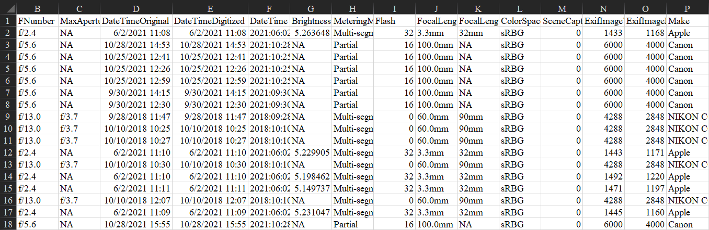

# CCBER-Capstone

## Scanner.py
Scanner is a script that helps read and decode barcodes/datamatrixes. The method uses preprocessing to accurately identify regions where the 
QR/Datamatrix may be. When provided a path to the image folder, the script will iterate through each image in the folder, apply the scanner method, and return the decoded value(if it exists). A copy of the images that returned a decoded value will be stored in a separate folder called renamed_image_folder. For the images that were unable to be renamed, a separate folder called unreadable_image_folder will be created to store them. For both cases, if there is already an existing labeled folder prior to running the script, the user will be prompted to enter a new name for which the respective images will be stored into. 

The Python libraries required to run the scanner are located in the requirements.txt. To install the packages accordingly, simply use:
```
pip install -r /path/to/requirements.txt
```
Here is a sample format to run in command prompt:
```
scanner.py "C:\Users\me\bee_project\bee_images"
```

## Exif_extract.py
The exif_extract script can be used to read in exif metadata from all .jpg images in a given directory location and save the formattted result to a .csv file. This program extracts a pre-specified number of relevant exif tags (fields) for each image read.

Below is an example of the .csv output.

<p align="center">

</p>
